CP/M-65
=======

What?
-----

This is a native port of Digital Research's seminal 1977 operating system CP/M
to the 6502. So far it runs on:

  - The BBC Micro family, including Master, Tube, and Electron; TPA ranges from
    14kB on the Electron to 57kB on the Tube.

  - Commodore 64; TPA is 55kB.
  
  - Commodore VIC-20; TPA is 24kB.

  - Commodore PET 4032, 8032 and 8096; the TPA ranges from 25kB on the 4032 to
    57kB on the 8096.

  - Commander X16; TPA is 46kB.

  - Apple IIe; TPA is 46kB.

  - Atari 400/800 XL/XE; 16kB minimum; TPA ranging from 8.5kB up to over 49kB
    on a 64kB XL/XE machine.

  - Oric 1 and Oric Atmos (but not, currently, the Telestrat) with Microdisc
    interface; TPA 44kB.

  - The Super Nintendo. Yes, really. You get a 1440kB romdisk, a 128kB
    battery-backed ramdisk in cartridge memory, and one 1440kB floppy drive --- if
    you have the right hardware. TPA 58kB.

  - Sorbus homebrew 6502-based computer.
  
  - Olimex' neo6502 6502-based computer.

  - nano6502 6502-based SoC for the Tang Nano 20K FPGA board; TPA is 55kB.

  - KIM-1 with K-1013 FDC, directly connected SD card module, 1541 drive or Corsham's SD Shield.

  - Ohio Scientific series with 16kB RAM or more, and a floppy drive. TPA up to 39kB.

Unlike the original, it supports relocatable binaries, so allowing unmodified
binaries to run on any system: this is necessary as 6502 systems tend to be
much less standardised than 8080 and Z80 systems. (The systems above all load
programs at different base addresses.)

Currently you can cross-assemble programs from a PC, as well as a working C
toolchain with llvm-mos. For native development, there's a basic assembler, a
couple of editors, a BASIC, and a byte-compiled Pascal subset and interpreter.
You need about 20kB to run the assembler at all, and of course more memory the
bigger the program.

No, it won't let you run 8080 programs on the 6502!

<div style="text-align: left">
<a href="doc/bbcmicro.png">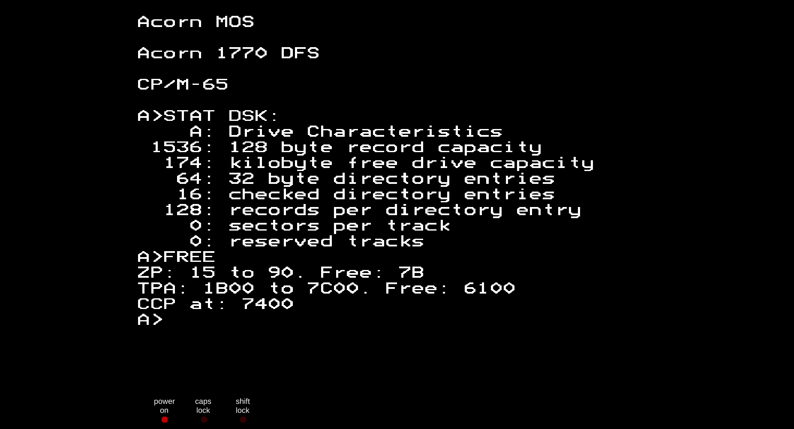</a>
<a href="doc/c64.jpg">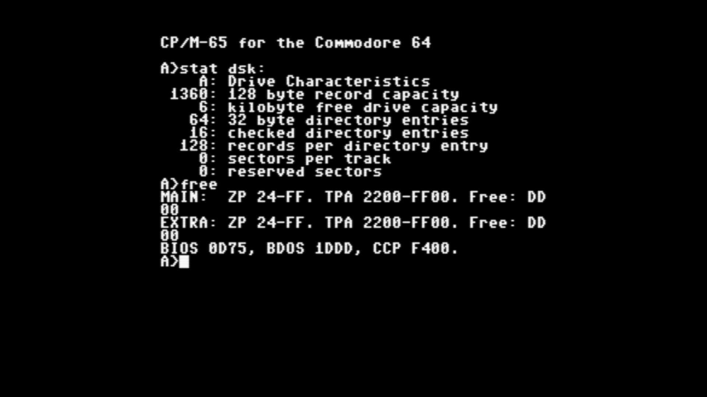</a>
<a href="doc/x16.png"></a>
<a href="doc/apple2e.png"></a>
<a href="doc/pet4032.png">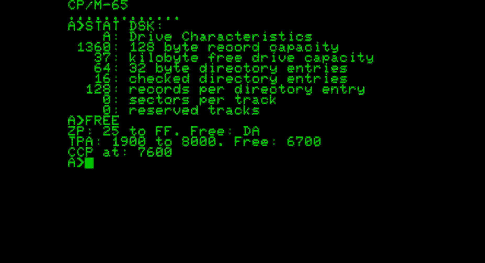</a>
<a href="doc/pet8032.png">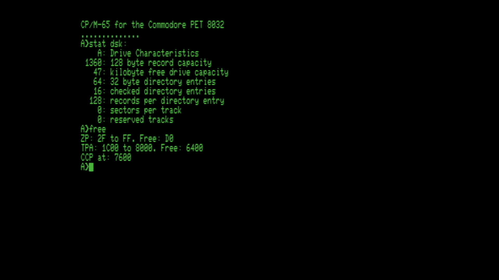</a>
<a href="doc/pet8096.png">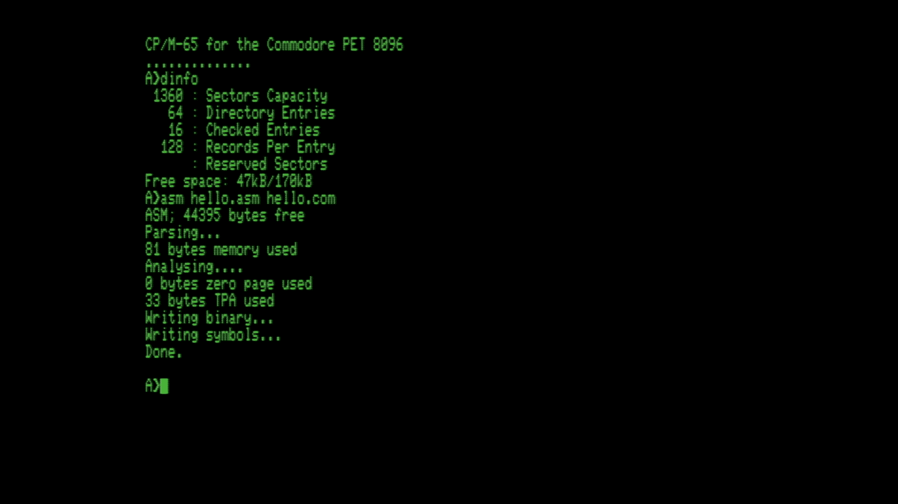</a>
<a href="doc/vic20.png">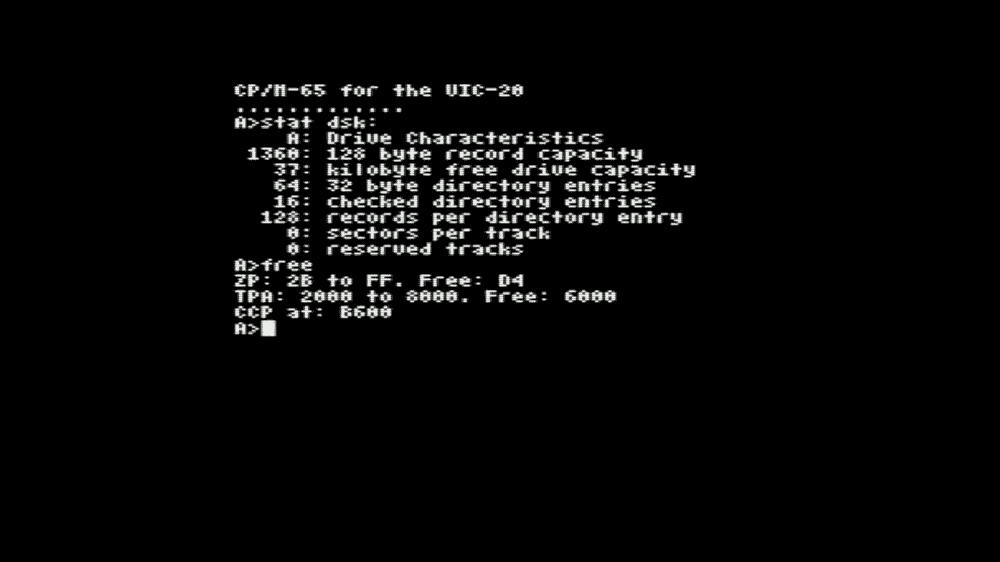</a>
<a href="doc/atari800.png">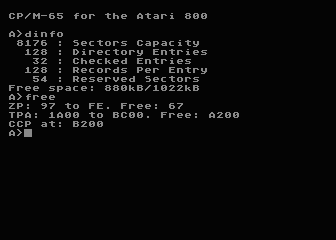</a>
<a href="doc/oric.png">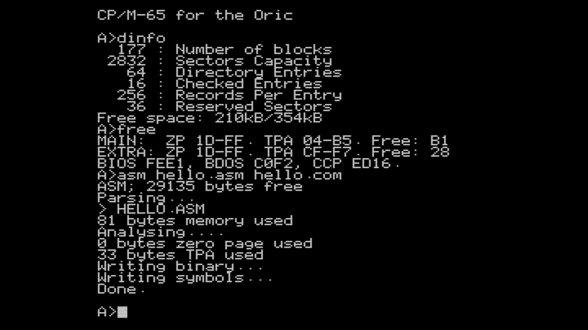</a>
<a href="doc/snes.png">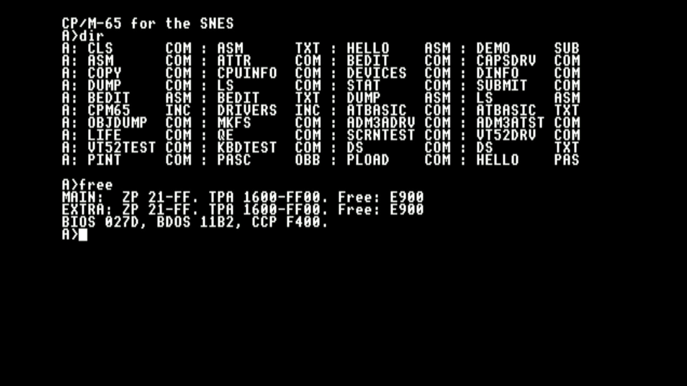</a>
<a href="doc/sorbus.png">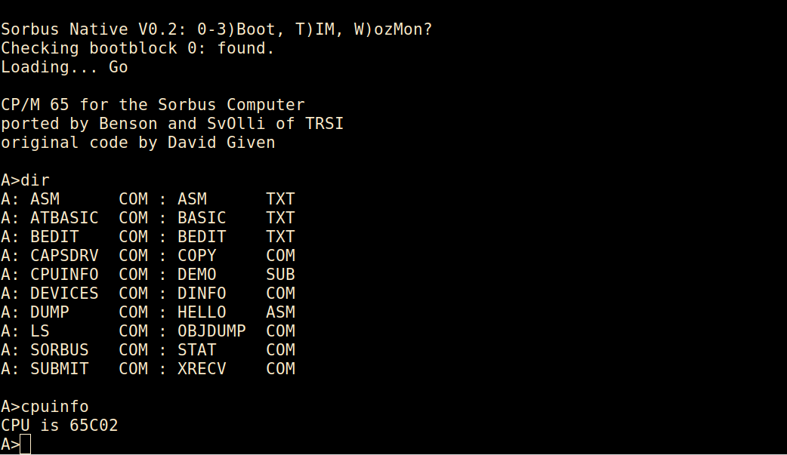</a>
<a href="doc/neo6502.png">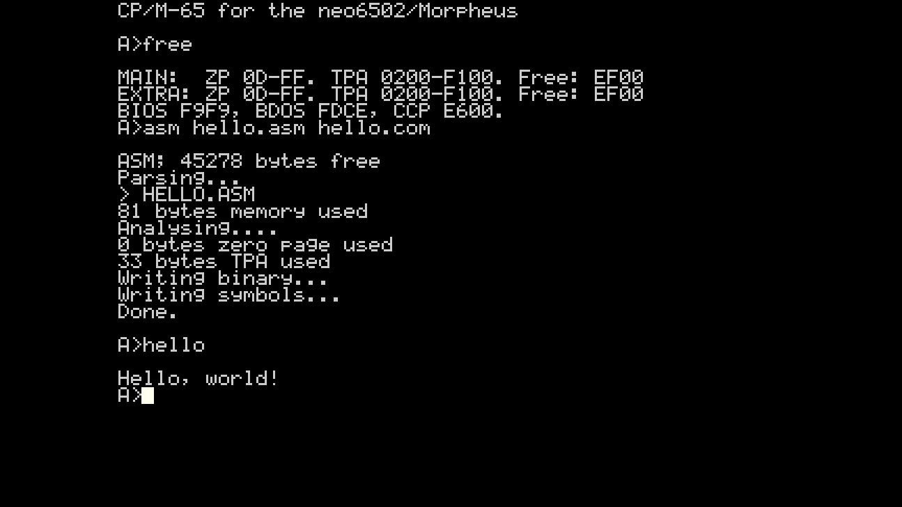</a>
<a href="doc/nano6502.png">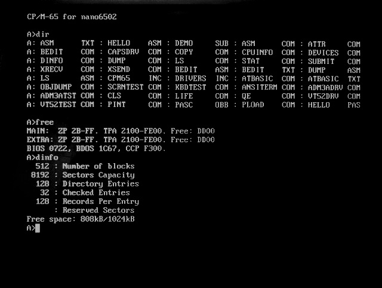</a>
<a href="doc/kim-1.png">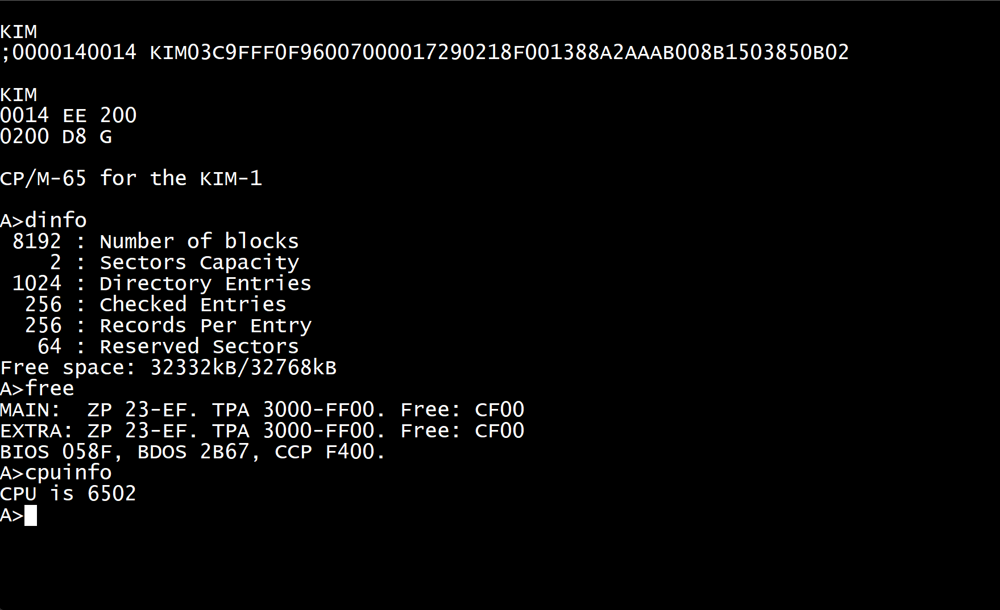</a>
<a href="doc/osi.png">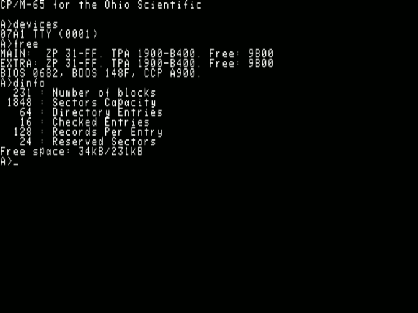</a>
</div>


Why?
----

Why not?


Where?
------

It's [open source on GitHub!](https://github.com/davidgiven/cpm65)


How?
----

You have two options:

  - [Download a binary
    release.](https://github.com/davidgiven/cpm65/releases/tag/dev) You can then
    copy this onto a disk for booting on a real machine, or use it in an
    emulator.

  - or build it yourself.

To build it, you will need the [llvm-mos](https://llvm-mos.org) toolchain.
CP/M-65 support is available out of the box. Once installed, you should just be
able to run the Makefile and you'll get bootable disk images for all supported
platforms in the `images` directory:

    make LLVM=<your llvm-mos bin directory here>/

Building CP/M-65 is a bit of a performance because it's aggregating lots of
other software, all of which need building in turn. You'll need primarily: a C
and C++ compiler, cc1541 (for creating 1541 disk images), cpmtools (for creating
CP/M disk images), libfmt (all the C++ tools use this), python3 (for the build
system), FreePascal (because the MADS assembler is written in Pascal), 64tass
(for the Super Nintendo 65816 stuff). Use these Debian packages:

    cc1541 cpmtools libfmt-dev fp-compiler moreutils mame srecord 64tass libreadline-dev

There are also automated tests which use `mame` to emulate a reasonable number
of the platforms, to verify that they actually work. To use this, install
`mame`, and then run `scripts/get-roms.sh` to download the necessary system
ROMs. Then do:

    make LLVM=<your llvm-mos bin directory here>/ -j$(nproc) +mametest

You can add `+all` to that if you want to do a normal build and run the tests at
the same time.

### BBC Micro notes

  - To run, do SHIFT+BREAK.

  - Alternatively, if you're on a Tube system, do:

    ```
    MODE 3
    *!BOOT
    ```

  - Alternatively alternatively, if you're on a Master system, do:

    ```
    MODE 131
    *DISK
    *!BOOT
    ```

  - It'll autodetect the amount of available memory. If you're _not_ on a Tube
    or Master system with shadow RAM, then your screen mode will consume TPA
    space. On a stock BBC Micro it _will_ run in mode 0, but you'll only get a
    2.5kB TPA! Mode 7 will work better here. It will work on the Electron, but
    you'll have to use mode 6 which will leave you 14kB of TPA. That's
    unfortunately not enough to run the assembler.

  - The CP/M file system is stored in a big file (called cpmfs). This will
	  expand up to the size defined in diskdefs: currently, 192kB (the largest
	  that will fit on a SSSD disk). All disk access is done through MOS so you
	  should be able to use a ramdisk, hard disk, Econet, ADFS, VDFS, etc. If so,
	  you'll want to define your own disk format and adjust the drive definition
	  in the BIOS to get more space.

  - The BBC Micro port has a SCREEN driver.

### Commodore 64 notes

  - Load and run the `CPM` program to start.

  - It has its own built-in fastloader, which has been lightly tested but seems
    to work on both NTSC and PAL C64s. It needs tuning but currently seems to get
    about 1100 bytes per second, which is 4x the normal 1541 speed. (It's the same
    one as for the VIC-20.)

  - The disk image produced is a hybrid of a CP/M file system and a CBMDOS file
	  system, which can be accessed as either. The disk structures used by the
	  other file system are hidden. You get about 170kB on a normal disk.

  - It'll only work on a 1541 or a 1571 in compatibility mode. Because of the
    fastloader. Sorry. Porting it to other drives is perfectly possible, I just
    haven't done it.

  - This won't work on MAME. You'll need VICE to emulate it.

  - There's a SCREEN driver.

### VIC-20 notes

  - See the Commodore 64 above. There are several versions available (built with
    different options):

    - `vic20_yload_1541.d64`: 1541 format, with the fastloader. Only works on a
      1541 (or compatible).
    - `vic20_iec_1541.d64`: 1541 format, uses old-fashioned IEC code. Should
      work anywhere which supports `d64` images, although very, very slowly.
    - `vic20_iec_fd2000.d2m`: CMD FD-2000 format, uses old-fashioned IEC code.
      Faster that the `d64` IEC version, but still pretty slow. But you do
      get lots of disk space.

  - You need a fully expanded VIC-20 with all memory banks populated, for the
    full 35kB.

  - You get a 40x23 screen, emulated using a four-pixel-wide soft font. It
    doesn't look great but is surprisingly readable, and is vastly better than
    the VIC-20's default 22x24 screen mode.

  - There's a SCREEN driver.

### Commodore PET notes

  - You need a PET 4032, 8032 or 8096 and either a 4040 disk drive or something
    else which supports the same geometry. The disk image is for a 35-track
    SSSD system (I made it with cc1541). Adapting it for other drives should be
    easy.

  - The 4032 is set up for the Graphics Keyboard. The 8032 and 8096 are set up
    for the Business Keyboard. (It would also be trivial to emulate the
    Business Keyboard on the Graphics Keyboard, but that is likely to be
    confusing.) Both use the RVS/OFF key as the CTRL key; some PET models
    actually label this as such.

  - It supports drive 0: only.

  - This port runs completely bare-metal and does not use any ROM routines.

  - The PET port has a SCREEN driver.

### Commander X16 notes

  - To use, place the contents of the `x16.zip` file on the X16's SD card. Load
	  and run the `CPM` program to start.

  - The CP/M filesystem is stored in a big file called CPMFS. It needs support
	  for the Position command in order to seek within the file. `x16emu`
	  currently doesn't support this in its host filesystem, so you'll need to
	  use an actual SD card image. (I have a [pull request
	  outstanding](https://github.com/commanderx16/x16-emulator/pull/435) to add
	  support. An SD2IEC should work too, as these support the same commands.
	  However a real Commodore disk drive _will not work_.

### Apple IIe notes

  - To use, place the contents of the `appleiie.po` file onto a disk and boot
    it. The disk image has been munged according to ProDOS sector ordering.

  - The contents of the `appleiie_b.po`can be placed on the second drive.

  - It supports two drives on slot 6. You need a 80-column card (but not any
  aux memory). The console is a standard 80x24, and there is a SCREEN driver.

  - This port runs completely bare-metal and does not use any ROM routines.

### Atari 800 XL/XE notes

  - Standard 720 sectors single-sided single-density disk. The first
    track is reserved (18 sectors). The rest contains a standard CP/M 2.2
    filesystem. Boot with BASIC disabled. This one runs on any Atari with
    at least 16kB of RAM.

  - Or a 1MB harddisk image for use with drive emulators like SIO2SD,
    RespeQT, SDrive, AVG Cart etc... You can also mount it off a FAT
    partition with an SIDE2/3 cartridge and boot from there. That's almost
    emulation speed on real hardware. This one comes in two flavors.
    The hd version runs on any Atari with at least 16kB of RAM, the xlhd
    version is tailored for the XL/XE with at least 64kB of RAM. BIOS, BDOS
    and CCP live "under" the Atari OS ROM, which leaves over 49kB of TPA.

  - Console is standard 40x24. It has a SCREEN driver.

  - User area 1 contains loadable fonts and a utility to set a new
    console font (setfnt.com). This consumes at least 1kB of TPA (depending
    on the padding needed for alignment), but shows proper glyphs like curly
    braces and tilde.

  - It also contains a loadable software 80 columns driver called
    ```tty80drv.com```. This will cost you 7kB of TPA for driver code,
    font data, and screen memory. It has a full SCREEN implementation, too.

   - The single-sided single-density version supports up to four drives.
     Extra applications and source code are spread accross the extra disks.
     The 1MB images support two drives, but only one is used at the moment.

### Oric notes

  - This disk image is a MFM_DISK format disk as used by Oricutron. (If you need
    a simple sector image, look at `.obj/oric.img`.) You get about 350kB on a
    disk. The CCP, BIOS and BDOS all live in overlay RAM, leaving the entire user
    memory available for programs.

  - If you're trying to run this on an Oric 1, you need the full upgrade to
    64kB (including overlay RAM).

  - Only the Microdisc interface currently works. (It's supposed to work with
    Jasmin too, but with Oricutron it boots but the keyboard is unresponsive, and
    on MAME it boots into BASIC, and I don't know why.) Only the first drive is
    supported. This would be easy to extend if anyone's interested.

  - The console is 40x28. It has a SCREEN driver.

  - The port runs completely bare-metal and does not use any ROM routines.

### Super Nintendo notes

  - Yes, it works! You get a 2MB HiRom cartridge with 128kB SRAM and an embedded
    1440kB romdisk. It boots from the romdisk, meaning you can't change the BDOS
    or CCP, or run submit files (because these operate through temporary files
    on drive A:, which on the SNES is read only).

  - If you want to interact with it, you'll need some completely unavailable
    unreleased Nintendo prototype hardware which provides a keyboard and floppy
    drive. It's so rare I can't even link to a page about it. More likely you'll
    want to use this version of BSNES-Plus which has been patched to support this
    hardware: https://github.com/MrL314/bsnes-plus/tree/sfx-dos It might be
    possible to port it to use one of the [several floppy-disk-based cartridge
    copiers](https://en.wikipedia.org/wiki/Game_backup_device) and the very rare
    [XBAND
    keyboard](https://ia903404.us.archive.org/22/items/x-band-keyboard/X-Band%20Keyboard_text.pdf).
    If anyone knows of an emulator which supports these, please [let me
    know](https://github.com/davidgiven/cpm65/discussions/new/choose) because I'd
    really like to support these.

  - Drive A is a 1440kB romdisk. Drive B is a 128kB ramdisk stored in the
    (emulated) cartridge battery backed RAM. Drive C is the floppy drive. Out of
    the box, both drives B and C are unformatted; do `mkfs b` or `mkfs c` to
    create filesystems on them.

  - It's super quick; the SNES has a 7MHz 65816. There's a SCREEN driver. The
    console is 64.

### Sorbus notes

  - The Sorbus Computer is a simple, open and cheap (<$15) machine to learn
    about the 65(C)02 processor. It combines an original CPU with a Raspberry
    Pi RP2040 microcontroller that implements all the rest (like RAM, I/O, and
    clock).

  - For building a full image, it is also possible to copy the compiled
    binaries into the proper position into the source tree, and just run a
    global build.

  - More info is available here:
    - [Homepage with lightning talk](https://xayax.net/sorbus/)
    - [Source code on github](https://github.com/SvOlli/sorbus)

### neo6502 notes

  - The neo6502 is a W65C02-based computer using emulated hardware implemented
    by a RP2040. This can be programmed with various different firmware packages,
    each emulating a different 6502-based microcomputer. This port is intended for
    the native firmware package for the neo6502,
    [Morpheus](https://github.com/paulscottrobson/neo6502-firmware/wiki). (The
    other ports will work if you install the appropriate emulation firmware
    package.)

  - It is ridiculously fast.
  
  - To use, unzip the `cpm65.zip` file into the any directory of the USB stick
    or other storage card. Then enter `*cd your_directory_name` and then `load
    "cpm65.neo"` at the prompt. CP/M-65 will run.

  - To run on the emulator, either load it as above, or boot it directly with
    `neo CPM65.NEO@8000 run@8010`. Remember that if you're running the emulator
    on Linux, the filesystem is CASE SENSITIVE so you need to spell `CPM65.NEO`
    using capital letters. (One CP/M-65 is running this is no longer a concern.)

  - This port uses an emulated BDOS, meaning that it stores its files as FAT
    files on the neo6502's USB stick. Most well-behaved CP/M-65 programs will
    work, but anything which tries to access the raw filesystem won't; such as
    `STAT` or `DINFO`. Files for each drive and user are stored in separate
    subdirectories. All 16 drives are supported (in directories `A` to `O`).

  - Drive `B` (i.e. `/B/` on the storage device) contains some neo6502-specific
    utilitied. This are in no way complete, or documented.

  - The console is 53x30. It has a SCREEN driver.

### nano6502 notes

  - The [nano6502](https://github.com/venomix666/nano6502/) is a 65C02-based SoC for the Tang Nano 20K FPGA board.
   
  - The CPU is running at 25.175 MHz (i.e. the pixel clock).

  - It is using CPMFS directly on the microSD-card, with 15x1Mb partitions (drives `A` to `O`).

  - The text output is over HDMI, with 640x480 video output and a 80x30 console. It has a SCREEN driver.

  - The text input can be done using either the built in USB serial port or a USB keyboard with the [nanoComp](https://github.com/venomix666/nanoComp) carrier board. This way, this port can be run with only the Tang Nano 20K board, or with the carrier board for stand-alone use.

  - To use, write the `nano6502.img` file into the SD-card using `dd` or your preferred SD-card image writer. If you are updating the image and want to preserve the data on all drives except `A`, write the `nano6502_sysonly.img` instead.

  - User area 1 on drive `A` contains utilities for setting the text and background colors, setting the baudrate on on the second UART and a demo application which blinks the onboard LEDs.
  - A SERIAL driver is available for the second UART, connected to pin 25 (RX) and 26 (TX) of the FPGA (and the UART header on the nanoComp carrier board). The baudrate defaults to 9600 baud but can be configured by the utility in user area 1.

### KIM-1 with K-1013 FDC notes

  - To run this on an KIM-1, you need an MTU K-1013 Floppy Disk Controller with an SSDD 8'' disk (or this [Pico based RAM/ROM/Video/FDC card](https://github.com/eduardocasino/kim-1-programmable-memory-card)) and full RAM upgrade, including the 0x0400-0x13ff memory hole.

  - To use it, transfer the `diskimage.imd` image to an SSDD 8'' disk (or place it directly onto a FAT or exFAT formatted SD card and assign it to disk0 in the Pico card). Start the KIM-1 in TTY mode, load the `boot.pap` loader program into `0x0200` and execute it.

  - Up to 4 disks are supported.

  - Only TTY interface for now, no SCREEN driver.

### KIM-1 with directly attached SD card notes

  - This port uses Ryan E. Roth's [sdcard6502 for the PAL-1](https://github.com/ryaneroth/sdcard6502), which in turn is based on George Foot's [sdcard6502 for Ben Eater's 6502 computer](https://github.com/gfoot/sdcard6502).

  - You'll need an SDHC card of any capacity (only 32MB are used) and a generic Arduino SD card adapter **with 5V to 3.3V conversion**. See the links above for detailed requisites and connection instructions. 
  
  - To use it, transfer the `diskimage.raw` file to the SD card using `dd`. Balena Etcher also works in Windows, just ignore the "not a bootable image" warning. Start the KIM-1 in TTY mode, load the `bootsd.pap` loader program into 0x0200 and execute it.

  - For KIM-1 clones, you can place the bootloader into the free space of the KIM-1 rom. Write the contents of the `bootsd-kimrom.bin` file at 0x1AA0 (or 0x2A0 relative to the KIM-1 rom). This romable loader has two entry points:
    - 0x1AA0 is for cold start, that is, you can point the 6502 reset vector to 0x1AA0 if you want to start CP/M-65 at reset. In this case, the TTY is initialized to 9600 bauds, so make sure that your terminal is configured to that speed.
    - 0x1AB2 is for booting from the KIM monitor

  - For the KIM-1, at least a 32KB (56KB recommended) RAM expansion from 0x2000 is required, as well as RAM filling the 0x0400-0x13ff memory hole. The BIOS assumes that at least the required RAM is installed, and checks for extra RAM above 0xA000.

  - Same requisites apply to the PAL-1 and, additionally, the second 6532 expansion board.

  - 1 32MB disk supported.

  - Only TTY interface for now, no SCREEN driver.

### KIM-1 with Corsham's SD Shield notes

  - For this port, you'll need an original Corsham's SD Shield, [a clone like this one](https://github.com/eduardocasino/sd-card-shield) or even this [Raspberry Pi Pico based variant](https://retro-spy.com/product/sd-card-system/).

  - Place the `CPM-BOOT.DSK` image at the root of a FAT32 formatted SD card and create an `SD.CFG`file with this content:
    ```
    0:CPM-BOOT.DSK
    ```

  - Start the KIM-1 in TTY mode, load the `bootsdshield.pap` loader program into `0x0200` and execute it.

  - As for the SD variant above, for KIM-1 clones, you can place the `bootsdshield-kimrom.bin` bootloader into the free space of the KIM-1 rom, starting at 0x1AA0.

  - Same memory requirements as for the SD variant.

  - Up to 4 disks are supported.

  - Only TTY interface for now, no SCREEN driver.

  - An Image Manipulation Utility, `IMU.COM`, is included. It allows mounting and unmounting disk images and, [with the latest SD Shield firmware](https://github.com/eduardocasino/SD-drive/tree/version-2), even copy, rename, delete or create new ones.

### KIM-1 with Commodore 1541 drive

  - Based on the C64 port, so same notes apply.

  - This port needs the [xkim1541 extensions for the KIM-1 installed at 0xF000](https://github.com/eduardocasino/xkim1541). The PAL-1 is also supported, and needs the same extensions but installed at 0xDA00, [as modified by Neil Andretti](https://github.com/netzherpes/xkim1541).

  - If you also have [my modified xKIM monitor](https://github.com/eduardocasino/xKIM/tree/IEC_support), then load the `CPM` program and jump to address 0x6000.

  - If not, load the `bootiec-kim` or  `bootiec-pal` bootloader into 0x200 and execute it.

### Ohio Scientific notes

- Supported systems are:
  - 400 series, with Model 440 32x32 video, Model 470 disk controller (5.25" or 8"), and an ASCII keyboard.
  - 500 series, with Model 540 64x32 video, Model 505 disk controller (5.25" or 8"), and 542 polled keyboard.
  - 600 series, with on board 64x16 video, Model 610 disk controller (5.25" or 8"), and polled keyboard.
  - serial system, without video, Model 470 or 505 disk controller (8" only), and serial ACIA at $fc00.

- All systems need at least 16kB of RAM, but detect up to 40kB with BASIC present, and 48kB if BASIC is replaced by RAM.
  Some boot ROMs do not boot when BASIC is absent. For example, SYN600 relies on BASIC ROM routines to load the boot sector.

- The generated disk images can be used directly with
  [osiemu](https://github.com/ivop/osiemu), or converted to HFE format with its
  `osi2hfe` if you want to create real floppies or use it with a Gotek on real
  hardware.  For use with one of the two WinOSI emulators [Mark's
  Lab](https://osi.marks-lab.com/software/tools.html) has a tool to convert HFE
  images to 65D format.

- All systems boot with a plain TTY driver. If you have a 540B graphics card
  with the optional color option enabled, you can load a screen driver called
  `TTY540B` (located on drive D: on MF systems).  For the Model 630 graphics card
  there's `TTY630`.  On serial systems, you can load `SCRVT100` to enable the
  screen driver if you are connected with a VT100 terminal.

- The *600mf80* images are for a Superboard II/C1PMF with a non-standard
  5.25" drive with *80 tracks* instead of the standard 40 tracks. A 3.5"
  single density drive with 80 tracks would work, too.

### Supported programs

Commands include `DUMP`, `STAT`, `COPY`, `SUBMIT`, `ASM`, `QE` and `BEDIT` plus
some smaller utilities. I'd love more --- send me pull requests! The build
system supports cc65 assembler and llvm-mos C programs. The native assembler
can be used (in emulation) to cross compile programs for CP/M-65.

In the CCP, you get the usual `DIR`, `ERA`, `REN`, `TYPE` and `USER`. There is
no `SAVE` as on the relocatable CP/M-65 system assembling images in memory is
of questionable utility, but there's a new `FREE` command which shows memory
usage.

You also get a port of Altirra BASIC, an open source Atari BASIC clone. This is
called `ATBASIC`. See below for more details.

Pokey the Penguin loves to read your [pull
requests](https://github.com/davidgiven/cpm65/compare)!

### The assembler

The CP/M-65 assembler is extremely simple and very much customised to work for
the CP/M-65 environment. It operates entirely in memory (so it should be fast)
but it's written in C (so it's going to be big and slow). It's very very new
and is likely to have lots of bugs. There is, at least, a port of the DUMP
program to it which assembles, works, and is ready to play with.

Go read [cpmfs/asm.txt](cpmfs/asm.txt) for the documentation. 

### The BASIC

Altirra BASIC is an open source recreation of the BASIC used on the Atari 8-bit
machines (on which CP/M-65 runs, coincidentally). It has been heavily modified
by me to work on CP/M-65. Anything Atari-related has been removed, including
graphics, sound, etc. In addition, I have extended the error reporting, added
support for case-insensitive keywords (simply because Atari BASIC traditionally
requires upper case but most CP/M-65 platforms don't have caps lock keys!), and
fairly crudely added file I/O support. There is no screen editor. It is (should
be) binary compatible with Atari BASIC, although programs using Atari features
which aren't supported will of course not run.

It is currently rather fragile with a number of known (and, probably, unknown)
bugs. Please [file bug reports](https://github.com/davidgiven/cpm65/issues/new)!

Atari BASIC is rather different from Microsoft BASIC. Please consult [the user
manual](https://www.virtualdub.org/downloads/Altirra%20BASIC%20Reference%20Manual.pdf).

**Important!** Do not contact the author of Altirra BASIC for anything related
to the CP/M-65 port! Any bugs are strictly my fault.

### The editors

BEdit is an incredibly simple line editor modelled after a basic interpreter
(command entry, with LOAD, SAVE, LIST, line numbers etc). It's written in
machine code and assembled with the CP/M-65 assembler; you can assemble it
locally if you have a system with 30kB or more TPA. It'll run on all platforms.

Go read [cpmfs/bedit.txt](cpmfs/bedit.txt) for the documentation.

QE is a much less simple vi-inspired screen editor, written in C. it's much
more comfortable to use than BEDIT, but is about five times the size, and will
only run on systems with a SCREEN driver, as noted above (you can also use the
`DEVICES` command to see what devices your system supports).

DwarfStar is another screen editor. It has the same keybindings as WordStar,
so those familiar with that will feel right at home. For a refresher, see
the [documentation](third_party/dwarfstar/ds.txt), which was written in DS
itself and is also available within CP/M-65 on the systems that have DS.COM
installed.

### The Pascal

Pascal-M is a Pascal subset intended for use on very small machines. It compiles
to bytecode, M-code, which is then run with an interpreter. The compiler is
itself written in Pascal-M and is capable of compiling itself (very slowly).
There is a basic port to CP/M-65.

To use it, you need to use the interpreter, `PINT`, to run the compiler to
compile your program into an OBP file. This is then translated into an OBB file
by `PLOAD` (not written in Pascal!). You can then run the resulting OBB file
with `PINT`. For example:

```
A> PINT PASC.OBB HELLO.PAS HELLO.OBP
A> PLOAD HELLO.OBP HELLO.OBB
A> PINT HELLO.OBB
```

The compiler will also generate a `PROGRAM.ERR` file containing a copy of any
error messages that result from the compilation process.

Sadly, you need at least 36kB of free RAM to run the compiler, and also the disk
images for various systems are full, so it's only included for a few platforms.

Pascal-M is considerably simplified from the full Pascal language, with support
for only 16-bit integers, but it does support records, sets, enumerations,
pointers, nested functions and procedures, etc. Performance isn't brilliant but
it does work. CP/M-65 is very basic, consisting of support for `text` files
using the traditional `assign`/`reset`/`rewrite`/`close` API. You can have as
many open at once as you like but you can't seek inside a file. In addition,
while `new` is supported, there is no `dispose`.

For more information on Pascal-M, see [Hans Otten's
website](http://pascal.hansotten.com/px-descendants/pascal-m/pascal-m-2k1/).
However, do not report bugs on the CP/M-65 port to him --- [file bug reports
here](https://github.com/davidgiven/cpm65/issues/new) instead.

### Utilities

`bin/cpmemu` contains a basic CP/M-65 user mode emulator and debugger. It'll run
programs on the host environment with an emulated disk, which is very useful for
testing and development. To use:

`./bin/cpmemu .obj/dump.com diskdefs`

Add `-d` at the front of the command line to drop into the debugger --- use `?`
for basic help. It can only access 8.3-format all-lowercase filenames in the
current directory, but you can also map drives. Use `-h` for help.

Who?
----

You may contact me at dg@cowlark.com, or visit my website at
http://www.cowlark.com.  There may or may not be anything interesting there.
The CP/M-65 project was designed and written by me, David Given.

License
-------

Everything here so far _except_ the contents of the `third_party` directory is
© 2022-2023 David Given, and is licensed under the two-clause BSD open source
license. Please see [LICENSE](LICENSE) for the full text. The tl;dr is: you can
do what you like with it provided you don't claim you wrote it.

The exceptions are the contents of the `third_party` directory, which were
written by other people and are not covered by this license. This directory as
a whole contains GPL software, which means that if you redistribute the entire
directory, you must conform to the terms of the GPL.

`third_party/lib6502` contains a hacked copy of the lib6502 library, which is ©
2005 Ian Plumarta and is available under the terms of the MIT license. See
`third_party/lib6502/COPYING.lib6502` for the full text.

`third_party/tomsfonts` contains a copy of the atari-small font, which is ©
1999 Thomas A. Fine and is available under the terms of a minimal free license.
See `third_party/tomsfonts/LICENSE` for the full text.

`third_party/altirrabasic` contains a hacked copy of Altirra Basic, which is ©
2014 Avery Lee and is available under the terms of a minimal free license.  See
`third_party/altirrabasic/LICENSE.md` for the full text.

`third_party/mads` contains a copy of Mad Assembler, which is © 2018-2023 Tomasz
Biela and is available under the terms of the MIT license.  See
`third_party/mads/LICENSE` for the full text.

`third_party/pascal-m` contains a extremely hacked up copy of the Pascal-M
bytecode compiler and interpreter, which is © 1978-2021 Niklaus Wirth, Mark
Rustad and Hans Otten and is available under the terms of the MIT license. See
`third_party/pascal-m/LICENSE` for the full text.

`third_party/dwarfstar` contains DwarfStar, which is © 2024 by Ivo van Poorten
and is available under the terms of the BSD 2-Clause License. See
`third_party/dwarfstar/LICENSE` for the full text.

`third_party/zmalloc` contains a copy of zmalloc, which is © 2024 by Ivo van
Poorten and is available under the terms of the 0BSD License. See
`third_party/zmalloc/LICENSE` for the full text.
