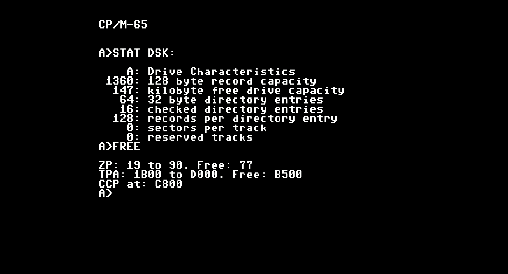

CP/M-65
=======

What?
-----

This is a native port of Digital Research's seminal 1977 operating system CP/M
to the 6502. So far it runs on:

  - The BBC Micro family, including Master, Tube, and Electron; TPA ranges from 14kB on the Electron to 57kB on the Tube.

  - Commodore 64; TPA is 46kB.
  
  - Commodore VIC-20: TPA is 24kB.

  - Commodore PET 4032; TPA is 26kB --- the assembler will run, just.

  - Commander X16; TPA is 46kB.

  - Apple IIe; TPA is 46kB.

Unlike the original, it supports relocatable binaries, so allowing unmodified
binaries to run on any system: this is necessary as 6502 systems tend to be
much less standardised than 8080 and Z80 systems. (The systems above all load
programs at different base addresses.)

Currently you can cross-assemble programs from a PC, as well as a working C
toolchain with llvm-mos. For native development, there's a basic assembler and
an even more basic editor. You need about 20kB to run the assembler at all, and
of course more memory the bigger the program.

No, it won't let you run 8080 programs on the 6502!

Why?
----

Why not?

Where?
------

It's [open source on GitHub!](https://github.com/davidgiven/cpm65)

How?
----

You will need the [llvm-mos](https://llvm-mos.org) toolchain. CP/M-65 support
is available out of the box. Once installed, you should just be able to run the
Makefile and you'll get bootable disk images for the Commodore 64 (with 1541
drive) and BBC Micro (producing a 200kB SSSD DFS disk).

### BBC Micro notes

  - It'll autodetect the amount of available memory. If you're on a Master or
    Tube system, I'd suggest making sure you're in mode 0 or 3 before running.
    On a BBC Micro... well, it _will_ run in mode 0, but you'll only get a
    2.5kB TPA! I suggest mode 7. On the Electron you have to use mode 6 which
    gives you 14kB of TPA, which isn't enough to run the assembler.

  - The CP/M file system is stored in a big file (called cpmfs). This will
	expand up to the size defined in diskdefs: currently, 192kB (the largest
	that will fit on a SSSD disk). All disk access is done through MOS so you
	should be able to use a ramdisk, hard disk, Econet, ADFS, VDFS, etc. If so,
	you'll want to define your own disk format and adjust the drive definition
	in the BIOS to get more space.

  - The BBC Micro port has a SCREEN driver.

### Commodore 64 notes

  - Load and run the `CPM` program to start.

  - It's excruciatingly slow as it uses normal 1541 disk accesses at 300 bytes
	per second. Everything works, but you won't enjoy it. At some point I want
	to add a fastloader.

  - The disk image produced is a hybrid of a CP/M file system and a CBMDOS file
	system, which can be accessed as either. The disk structures used by the
	other file system are hidden. You get about 170kB on a normal disk.

  - Disk accesses are done using direct block access, so it _won't_ work on
	anything other than a 1541. Sorry.

### VIC-20 notes

  - See the Commodore 64 above.

  - You need a fully expanded VIC-20 with all memory banks populated, for the
    full 35kB.

  - You get a 40x24 screen, emulated using a four-pixel-wide soft font. It
    doesn't look great but is surprisingly readable, and is vastly better than
    the VIC-20's default 22x24 screen mode.

  - Disk accesses are slightly faster than the Commodore 64, but only just.
    It's still a miserable experience.

### Commodore PET notes

  - You need a PET 4032 (no other model) and, probably, a 4040 disk drive. The
    disk image is for a 35-track SSSD system (I made it with cc1541). You could
    probably adapt things to work on other disk systems or other systems
    easily; the top end PET floppy drives could store a megabyte on a disk and
    would go nicely with the 8032's 80-column display.

  - This is set up for the Graphics Keyboard, which was a bad idea, but that's
    what my emulator was set up for. If you actually want to do anything with
    it, ask me and I'll do a Business Keyboard keymap. (Or I could emulate the
    Business Keyboard on the Graphics Keyboard.)

  - It's faster than the Comodore 64 version, but still not brilliant --- but
    you can run the assembler in real time without having to worry about
    retirement.

  - It supports drive 0: only.

  - This port runs completely bare-metal and does not use any ROM routines.

### Commander X16 notes

  - To use, place the contents of the `x16.zip` file on the X16's SD card. Load
	and run the `CPM` program to start.

  - The CP/M filesystem is stored in a big file called CPMFS. It needs support
	for the Position command in order to seek within the file. `x16emu`
	currently doesn't support this in its host filesystem, so you'll need to
	use an actual SD card image. (I have a [pull request
	outstanding](https://github.com/commanderx16/x16-emulator/pull/435) to add
	support. An SD2IEC should work too, as these support the same commands.
	However a real Commodore disk drive _will not work_.

### Apple IIe notes

  - To use, place the contents of the `appleiie.po` file onto a disk and boot
    it. The disk image has been munged according to ProDOS sector ordering.

  - It supports a single drive on slot 6 drive 1. You need a 80-column card
    (but not any aux memory).

  - This port runs completely bare-metal and does not use any ROM routines.

### Atari 800 XL/XE notes

  - Standard 720 sectors single-sided single-density disk. The first three
    tracks are reserved (54 sectors). The rest contains a standard CP/M 2.2
    filesystem. Boot with BASIC disabled.

  - Uses the Atari OS boot loader to load both BIOS and BDOS to avoid needing
    Atari DOS 2.0 DOS.SYS which would consumes precious memory and is useless
    afterwards. CCP.SYS is loaded from the CP/M filesystem.

  - Console is standard 40x24 and it uses the Atari OS routines to read the
    keyboard and write to the screen.

  - There are 41728 bytes of TPA memory.

### Supported programs

Commands include `DUMP`, `STAT`, `COPY`, `SUBMIT`, `ASM`, `QE` and `BEDIT`. I'd
love more --- send me pull requests! The build system supports cc65 assembler
and llvm-mos C programs.

In the CCP, you get the usual `DIR`, `ERA`, `TYPE` and `USER`. There is no
`SAVE` as on the relocatable CP/M-65 system assembling images in memory is of
questionable utility, but there's a new `FREE` command which shows memory
usage.

Pokey the Penguin loves to read your [pull
requests](https://github.com/davidgiven/cpm65/compare)!

### The assembler

The CP/M-65 assembler is extremely simple and very much customised to work for
the CP/M-65 environment. It operates entirely in memory (so it should be fast)
but it's written in C (so it's going to be big and slow). It's very very new
and is likely to have lots of bugs. There is, at least, a port of the DUMP
program to it which assembles, works, and is ready to play with.

Go read [cpmfs/asm.txt](cpmfs/asm.txt) for the documentation. 

### The editors

BEdit is an incredibly simple line editor modelled after a basic interpreter
(command entry, with LOAD, SAVE, LIST, line numbers etc). It's written in
machine code and assembled with the CP/M-65 assembler; you can assemble it
locally if you have a system with 30kB or more TPA. It'll run on all platforms.

Go read [cpmfs/bedit.txt](cpmfs/bedit.txt) for the documentation.

QE is a much less simple vi-inspired screen editor, written in C. it's much
more comfortable to use than BEDIT, but is about five times the size, and will
only run on systems with a SCREEN driver, as noted above (you can also use the
`DEVICES` command to see what devices your system supports).

### Utilities

`bin/cpmemu` contains a basic CP/M-65 user mode emulator and debugger. It'll run
programs on the host environment with an emulated disk, which is very useful for
testing and development. To use:

`./bin/cpmemu .obj/dump.com diskdefs`

Add `-d` at the front of the command line to drop into the debugger --- use `?`
for basic help. It can only access 8.3-format all-lowercase filenames in the
current directory, but you can also map drives. Use `-h` for help.

Who?
----

You may contact me at dg@cowlark.com, or visit my website at
http://www.cowlark.com.  There may or may not be anything interesting there.
The CP/M-65 project was designed and written by me, David Given. 

License
-------

Everything here so far _except_ the contents of the `third_party` directory is
© 2022-2023 David Given, and is licensed under the two-clause BSD open source
license. Please see [LICENSE](LICENSE) for the full text. The tl;dr is: you can
do what you like with it provided you don't claim you wrote it.

The exceptions are the contents of the `third_party` directory, which were
written by other people and are not covered by this license. This directory as
a whole contains GPL software, which means that if you redistribute the entire
directory, you must conform to the terms of the GPL.

`third_party/lib6502` contains a hacked copy of the lib6502 library, which is ©
2005 Ian Plumarta and is available under the terms of the MIT license. See
`third_party/lib6502/COPYING.lib6502` for the full text.

`third_party/tomsfonts` contains a copy of the atari-small font, which is ©
1999 Thomas A. Fine and is available under the terms of a minimal free license.
See `third_party/tomsfonts/LICENSE` for the full text.
